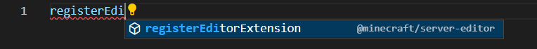
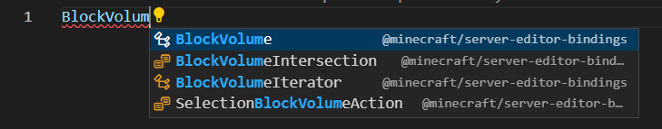

# Minecraft Editor APIs

> [!CAUTION] 
> This package is no longer maintained. Please install the official `@minecraft/server-editor` module on [npmjs.com](https://www.npmjs.com/package/@minecraft/server-editor):
> 
> ```bash
> npm i @minecraft/server-editor
> ```

Unofficial Minecraft: Bedrock Editor API modules type definitions.

The type definition files are still work in progress. Until v0.4 releases along with official type definitions, this module will be used for type checking scripts that uses editor APIs in the [ScriptAPI](https://github.com/JaylyDev/ScriptAPI) GitHub repository.

## Usage

Install `@jayly/minecraft-editor` package in NPM, this installs type definition for all editor API modules.

```
npm install @jayly/minecraft-editor
```

Then you must include the following in TSConfig. This allows the editor API modules to be included without importing `@jayly/minecraft-editor` package.

```json
{
  "compilerOptions": {
    "types": ["minecraft-editor"],
    "typeRoots": ["./node_modules/@jayly"],
  },
}
```

To test if this works, you can go on VSCode and type some variable names to see if auto complete will detect variable from modules:

- `@minecraft/server-editor`



- `@minecraft/server-editor-bindings`



## Versioning

Major to patch versions (`x.x.x`) represents Minecraft Editor API versions, revision version represents changes to type definitions in specific Minecraft editor version.
